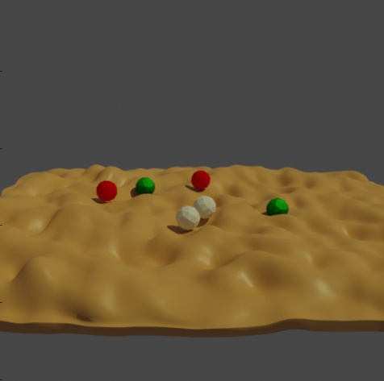

# Physics positioning



This example places some spheres randomly across a bumpy plane without any intersections between objects.
This is done via a physics simulation where the spheres are first placed randomly above the plane and then are influenced by gravity such that they fall down upon the plane until they find a new resting positon.

## Usage

Execute in the BlenderProc main directory:

```
blenderproc run examples/basics/physics_positioning/main.py examples/basics/physics_positioning/active.obj examples/basics/physics_positioning/passive.obj examples/basics/physics_positioning/output
```

* `examples/basics/physics_positioning/main.py`: path to the python file.
* `examples/basics/physics_positioning/active.obj`: path to the object file with active objects, i. e. objects which we want to participate in physics simulation.
* `examples/basics/physics_positioning/passive.obj`: path to the object file with passive objects, i. e. objects which we do not want to participate in physics simulation, e.g. plane.
* `examples/basics/physics_positioning/output`: path to the output directory.

## Visualization

Visualize the generated data:

```
blenderproc vis hdf5 examples/basics/physics_positioning/output/0.hdf5
```

## Steps

### Random positioning

```python
# Define a function that samples the pose of a given sphere
def sample_pose(obj: bproc.types.MeshObject):
    obj.set_location(np.random.uniform([-5, -5, 8], [5, 5, 12]))
    obj.set_rotation_euler(bproc.sampler.uniformSO3())

# Sample the poses of all spheres above the ground without any collisions in-between
bproc.object.sample_poses(
    spheres,
    sample_pose_func=sample_pose
)

```

At first, we define a fct, which sets the given objects to new poses. This function is then used in the `bproc.object.sample_poses` fct call, where it is called on each object and then checked if a collision with the other objects occurs.
This process is repeated until all objects are placed without collisions.

### Run physics simulation

```python
# Make all spheres actively participate in the simulation
for obj in spheres:
  obj.enable_rigidbody(active=True)
# The ground should only act as an obstacle and is therefore marked passive.
# To let the spheres fall into the valleys of the ground, make the collision shape MESH instead of CONVEX_HULL.
ground.enable_rigidbody(active=False, collision_shape="MESH")

# Run the simulation and fix the poses of the spheres at the end
bproc.object.simulate_physics_and_fix_final_poses(min_simulation_time=4, max_simulation_time=20, check_object_interval=1)
```

We now set all sphere objects to be active by enabling the rigidbody attribute on them. For the ground the active attribute is set to False, meaning that it will be passive in the scene.
But active objects are able to interact with it. The collision shape for the ground is `MESH`, instead of the default `CONVEX_HULL`.
Keep in mind that using the mesh collision shape in more complex use-cases can cause performance and glitch issues. 
If you experience those it is better to checkout the [physics_convex_decomposition](../../advanced/physics_convex_decomposition/README.md).

When running the physics simulation the function checks in intervals of 1 second, if there are still objects moving. If this is not the case, the simulation is stopped.
Nevertheless, the simulation is run at least for 4 seconds and at most for 20 seconds.

At the end of the simulation the position of all spheres is made fixed again.
In this way we can easily sample random positions of the spheres on top of the bumpy plane.
