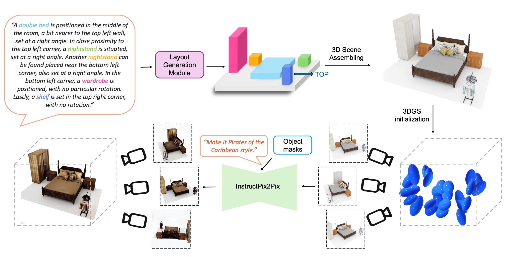

# SceneTeller: Language-to-3D Scene Generation (ECCV 2024)

### [**Project Page**](https://sceneteller.github.io/) | [**Paper**](https://arxiv.org/abs/2407.20727) | [**YouTube**](https://www.youtube.com/watch?v=N0578Zn_r_U)

SceneTeller generates realistic and high-quality 3D spaces from natural language prompts describing the object placement in the room.

<div align="center">
    
</div>

## News
- Dec 16, 2024 🔥🔥: We released SceneTeller.
- Jul 1, 2024 🔥: SceneTeller is accepted at ECCV 2024!

## Installation & Dependencies

1. Clone our repo and create conda environment.
```
git clone https://github.com/sceneteller/SceneTeller.git && cd SceneTeller
conda create -n sceneteller python=3.8 -y
pip install -r requirements.txt
```

2. Install other dependencies.
```
# For scene assembling with ATISS
cd LayoutGen/ATISS
python setup.py build_ext --inplace
pip install -e .
cd ../..

# To render images and segmentation maps
cd BlenderProc
pip install -e .
cd ..

# For stylization
pip install torch==2.1.2+cu118 torchvision==0.16.2+cu118 --extra-index-url https://download.pytorch.org/whl/cu118
conda install -c "nvidia/label/cuda-11.8.0" cuda-toolkit

cd nerfstudio
pip install --upgrade pip setuptools
pip install -e .
cd ..

cd instruct-gs2gs
pip install -e .
```

## Dataset

Download [3D-FUTURE-model](https://tianchi.aliyun.com/dataset/65347), [3D-FRONT-texture](https://tianchi.aliyun.com/dataset/65347) and [preprocessed data](https://drive.google.com/file/d/1NV3pmRpWcehPO5iKJPmShsRp_lNbxJuK/view?usp=sharing) from LayoutGPT to ```./scene_data/```. Then unzip these files. 
```
cd scene_data
unzip 3D-FUTURE-model.zip 
unzip 3D-FRONT-texture.zip 
unzip data_output.zip
```
The 3D scene data split provided by LayoutGPT is located in ```./LayoutGen/dataset/splits-orig```. We further preprocess the data to remove scenes with overlapping objects and out-of-bounds (OOB) conditions, as well as to generate preliminary rule-based textual descriptions for the scenes. The preprocessed split is located in ```./LayoutGen/dataset/splits-preprocessed```. You can preprocess the data by yourself by running:
```
python preprocess_data.py --dataset_dir ./scene_data/data_output --room bedroom 
```

## 3D Layout Generation

First set up your OpenAI authentication in the following scripts, then run the scripts.

To enhance the rule-based scene descriptions using GPT, run the following command. Remove the ```--generate_train``` flag to generate descriptions also for the test data with ```--base_output_dir ./llm_output/bedroom-train-prompt```.
```
cd LayoutGen
python run_layoutgen_3d_generateprompt.py --dataset_dir ../scene_data/data_output/bedroom --room bedroom --gpt_type gpt4 --unit px --regular_floor_plan --generate_train --base_output_dir ./llm_output/bedroom-test-prompt
```

To generate 3D layouts, run the following command:
```

```

## Scene Assembling


## 📑 Citation
If you find our work useful, please consider citing:
```
@article{ocal2024sceneteller,
  title     = {SceneTeller: Language-to-3D Scene Generation},
  author    = {{\"O}cal, Ba{\c{s}}ak Melis and Tatarchenko, Maxim and Karaoglu, Sezer and Gevers, Theo},
  journal   = {arXiv preprint arXiv:2407.20727},
  year      = {2024},
}
```
## Disclaimer

We thank the authors of [LayoutGPT](https://github.com/weixi-feng/LayoutGPT/tree/master) and [ATISS](https://github.com/nv-tlabs/ATISS/tree/master) for making their code available. Please note that the code provided here is not the official or original version created by the respective individual or organization. Any use of the downstream generation code must comply with the terms and conditions established by the original authors or organizations. It is your responsibility to ensure proper compliance.
